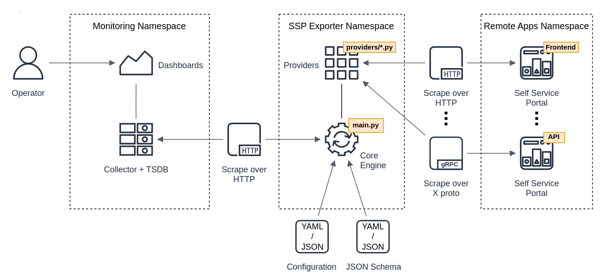
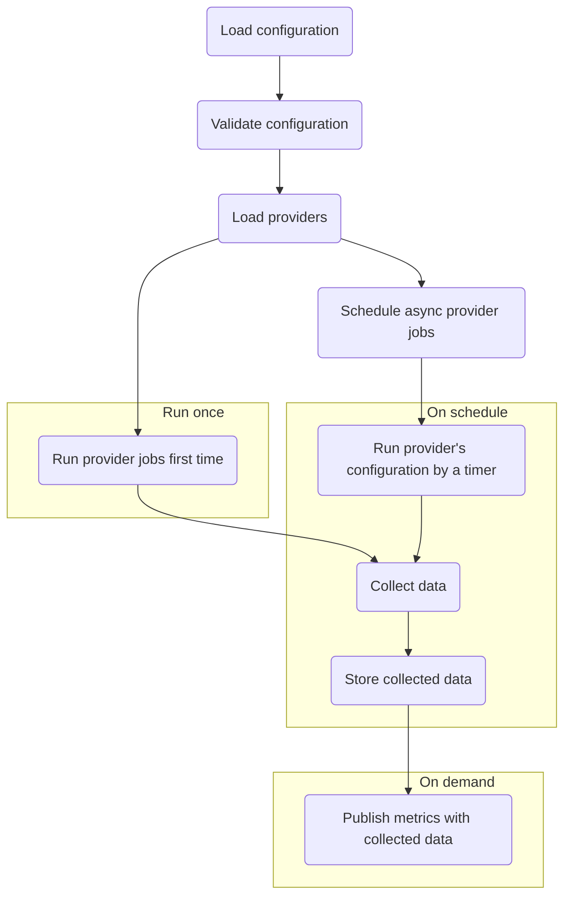
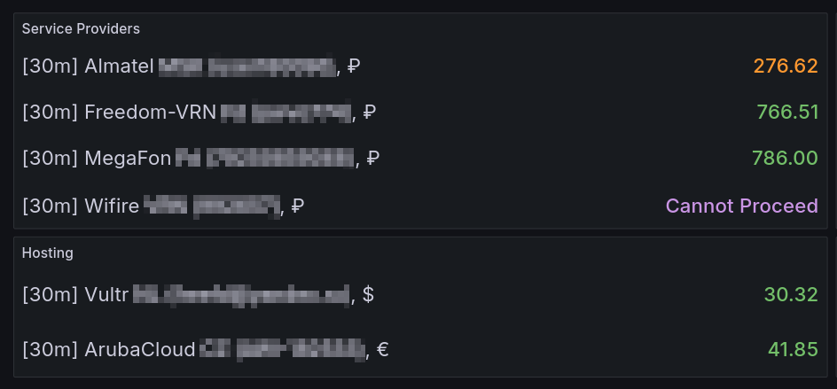
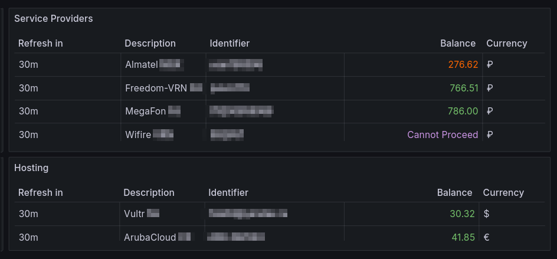

# Self Service Portal Exporter

- [Description](#description)
- [Design](#design)
   * [Simplified System Design](#simplified-system-design)
   * [Execution Workflow](#execution-workflow)
   * [Metrics sample](#metrics-sample)
- [Application Settings](#application-settings)
   * [Configuration File](#configuration-file)
   * [JSON Schema File](#json-schema-file)
   * [Environmental Augmentation](#environmental-augmentation)
- [Exporter Deployment](#exporter-deployment)
   * [Bare metal or Virtual Machine](#bare-metal-or-virtual-machine)
   * [Pure Podman or Docker](#pure-podman-or-docker)
   * [Podman-Compose or Docker-Compose](#podman-compose-or-docker-compose)
   * [Kubernetes](#kubernetes)
- [Data Visualization](#data-visualization)
   * [Available Return Codes](#available-return-codes)
   * [Grafana Dashboard Overrides](#grafana-dashboard-overrides)
   * [Grafana Panels](#grafana-panels)
- [Writing a Custom Provider](#writing-a-custom-provider)

## Description
This exporter is designed to export balance value from Self Service Portals and store it in [TSDB](https:///) database (native, 3rd-party). Existing exporter provider modules are prepared for:
* [Almatel (Russia)](https://almatel.ru/), Internet Service Provider
* [Aruba Cloud](https://arubacloud.com/), Cloud Service Provider
* [Freedom-VRN](https://freedom-vrn.ru), Internet Service Provider
* [MegaFon B2C (Russia)](https://megafon.ru/), Service Provider
* ~~[T2 B2C (Russia)](https://T2.ru/), Service Provider~~, _dysfunctional since mid-2024 due to introduced strict 2FA with OTP over Email or SMS_ 
* [Vultr](https://vultr.com/), Cloud Service Provider
* [Wifire (Russia)](https://wifire.ru/), Internet Service Provider

## Design
### Simplified System Design


### Execution Workflow


At startup, the exporter configuration is validated against [JSON schema](https://json-schema.org/), then the exporter reads `providers` directory with modules, loads them one by one, schedules jobs for the `update_balance()` function from each provider, and triggers the first collection attempt. The [Prometheus Client](https://github.com/prometheus/client_python) dynamically registers [GaugeMetricsFamily](https://github.com/prometheus/client_python#custom-collectors) metrics using labels from the corresponding configuration.

On the monitoring side, the collected metrics values are scraped by a [collector](https://prometheus.io/docs/instrumenting/writing_exporters/#collectors) compatible with the [Prometheus metric format](https://prometheus.io/), and stored in a [TSDB](https://en.wikipedia.org/wiki/Time_series_database). Later the collected data is represented via dashboards, e.g. [Grafana](https://grafana.com).

### Metrics sample

```
...
# HELP ssp_balance AlmatelRussia
# TYPE ssp_balance gauge
ssp_balance{category="SP",currency="₽",description="Almatel RegionCode1",identifier="user123456",poll_interval="30m",provider="AlmatelRussia"} 387.32
# HELP ssp_balance ArubaCloud
# TYPE ssp_balance gauge
ssp_balance{category="Hosting",currency="€",description="ArubaCloud RegionCode1",identifier="1234566@aruba.it",poll_interval="30m",provider="ArubaCloud"} 19.78
# HELP ssp_balance MegafonRussiaB2C
# TYPE ssp_balance gauge
ssp_balance{category="SP",currency="₽",description="Megafon User1",identifier="79201234567",poll_interval="30m",provider="MegafonRussiaB2C"} 790.1
# HELP ssp_balance Vultr
# TYPE ssp_balance gauge
ssp_balance{category="Hosting",currency="$",description="Vultr RegionCode1",identifier="username@domain.tld",poll_interval="30m",provider="Vultr"} 13.32
# HELP ssp_balance WifireRussia
# TYPE ssp_balance gauge
ssp_balance{category="SP",currency="₽",description="Wifire RegionCode1",identifier="123456",poll_interval="30m",provider="WifireRussia"} 172.05
...
```

## Application Settings
The exporter requires 2 types of configuration:
* Configuration file with defined accounts of data providers
* JSON schema for configuration file format validation

Configuration files can be JSON or YAML format, the code will detect file type based on extension: .json, .yaml or .yml.

### Configuration File
Configuration file contains 2 top sections: `service` and `identifiers`.
The `service` section defines `metric_name`, possible `messages` encoded in the target values, and list of available `user_agents` to randomly select during each provider initialization. Message names are used in the provider's code, see [Writing a Custom Provider](#writing-a-custom-provider) chapter.
Sample in YAML representation:
```yaml
service:
  metric_name: ssp_balance
  messages:
    init: -1000000
    disabled: -1000001
    no_answer: -1000002
    captcha: -1000003
    cannot_proceed: -1000004
    rate_limit: -1000005
    parsing_error: -1000006
    connection_error: -1000007
  user_agents:
    - Mozilla/5.0 (Windows NT 10.0; Win64; x64) AppleWebKit/537.36 (KHTML, like Gecko) Chrome/105.0.0.0 Safari/537.36 Edg/105.0.1343.33
    - Mozilla/5.0 (Windows NT 6.3; Win64; x64) AppleWebKit/537.36 (KHTML, like Gecko) Chrome/91.0.4472.114 Safari/537.36
    - Mozilla/5.0 (X11; Fedora; Linux x86_64; rv:89.0) Gecko/20100101 Firefox/89.0
    - Mozilla/5.0 (X11; Linux x86_64) AppleWebKit/537.36 (KHTML, like Gecko) Chrome/92.0.4515.107 Safari/537.36
    - Mozilla/5.0 (X11; Linux x86_64; rv:90.0) Gecko/20100101 Firefox/90.0
    - Mozilla/5.0 (X11; Ubuntu; Linux x86_64; rv:90.0) Gecko/20100101 Firefox/90.0
```

The `identifiers` section contains a list of available identifiers for each existing provider:
Key | Description | Mandatory | Type | Default Value
 -- | -- | -- | -- | --
identifier | Username or client ID to access Self Service Portal | Yes | String | No
password | Password or secret to access Self Service Portal | Yes | String | No
labels | Dictionary of additional labels in key:value format | No | String:Boolean \| Integer \| Float \| String | No
tls_verify | Whether to check TLS certificate against trusted certificate authorities | No | Boolean | False
poll_interval | Integer in seconds of interval for polling via scheduler | No | Integer | 3600
disabled | Prevent data collection | No | Boolean | False

Sample in YAML representation:
```yaml
identifiers:
  ProviderName:
    - identifier: provider_identifier
      password: provider_password
      labels:
        key1: value1
        key2: value2
        keyN: valueN
      poll_interval: 1800
```

### JSON Schema File
**TBD**

###  Environmental Augmentation

Since the exporter initially was designed to be containerized, some settings can be overriden by environment variables or command line arguments.

Argument Name | Variable Name | Description | Default Value
-- | -- | -- | --
--config, -c | SSP_EXPORTER_CONFIG_FILE | Path to configuration file | ./config/production_exporter.yaml
--schema, -s | SSP_EXPORTER_SCHEMA_FILE | Path to JSON schema | ./config/schema.json
--address, -a | SSP_EXPORTER_BIND_ADDRESS | Network address to bind server | localhost
--port, -p | SSP_EXPORTER_BIND_PORT | Network port to bind server | 10032 (see [Default port allocations](https://github.com/prometheus/prometheus/wiki/Default-port-allocations) from Prometheus community)
--loglevel, -l | SSP_EXPORTER_LOG_LEVEL | Set logging level.<br/>Possible values: NOTSET, DEBUG, INFO, WARNING, ERROR, CRITICAL | INFO

## Exporter Deployment

The [Dockerfile](https://github.com/freefd/ssp-exporter/Dockerfile) can be used to build a stateless container with Self Service Portal Exporter. Please pay attention to the [13th14th lines](https://github.com/freefd/ssp-exporter/Dockerfile#L13) where current repo will be downloaded and cleaned up from unnecessary files and directories, including /config with sample configuration and schema file. Hence, you need to provide configuration and schema file independently using environment variables of CLI arguments.

### Bare metal or Virtual Machine

Debian-based example:

```shell
$ sudo apt update
Get:1 http://deb.debian.org/debian bookworm InRelease [151 kB]
... omitted for brevity ...
Reading state information... Done
1 package can be upgraded. Run 'apt list --upgradable' to see it.

$ sudo apt -y dist-upgrade
Reading package lists... Done
Building dependency tree... Done
Reading state information... Done
Calculating upgrade... Done
The following packages will be upgraded:
... omitted for brevity ...

$ sudo apt -y install git locales python3 python3-pip python3-jsonschema python3-yaml python3-requests python3-lxml python3-schedule python3-prometheus-client
Reading package lists... Done
Building dependency tree... Done
Reading state information... Done
The following additional packages will be installed:
... omitted for brevity ...
Running hooks in /etc/ca-certificates/update.d...
done.

$ echo -e 'C.UTF-8 UTF-8\nen_US.UTF-8 UTF-8\nru_RU.UTF-8 UTF-8' | sudo tee /etc/locale.gen
C.UTF-8 UTF-8
en_US.UTF-8 UTF-8
ru_RU.UTF-8 UTF-8

$ sudo dpkg-reconfigure --frontend=noninteractive locales
Generating locales (this might take a while)...
  C.UTF-8... done
  en_US.UTF-8... done
  ru_RU.UTF-8... done
Generation complete.

$ git clone https://github.com/freefd/ssp-exporter
Cloning into 'ssp-exporter'...
... omitted for brevity ...
Resolving deltas: 100% (29/29), done.

$ cd ssp-exporter

$ shopt -s extglob

$ rm -rfv ./!(main.py|logger.py|providers|config) ./.*
removed './LICENSE'
... omitted for brevity ...
removed './.gitignore'

$ cp ./config/sample_exporter.yaml ./config/production_exporter.yaml
```
<br/>
Еdit `config/production_exporter.yaml` to suit your needs.
<br/>
<br/>
Run the exporter:

```shell
$ python3 ./main.py
[2025-03-30 09:04:21,036] INFO __init__.py::providers::<module>(): Load provider AlmatelRussia (providers/almatel_russia.py)
[2025-03-30 09:04:21,037] INFO __init__.py::providers::<module>(): Load provider ArubaCloud (providers/aruba_cloud.py)
[2025-03-30 09:04:21,038] INFO __init__.py::providers::<module>(): Load provider FreedomVrnRussia (providers/freedom_vrn_russia.py)
[2025-03-30 09:04:21,038] INFO __init__.py::providers::<module>(): Load provider MegafonRussiaB2C (providers/megafon_russia_b2c.py)
[2025-03-30 09:04:21,039] INFO __init__.py::providers::<module>(): Load provider T2RussiaB2C (providers/t2_russia_b2c.py)
[2025-03-30 09:04:21,039] INFO __init__.py::providers::<module>(): Load provider Vultr (providers/vultr.py)
[2025-03-30 09:04:21,040] INFO __init__.py::providers::<module>(): Load provider WifireRussia (providers/wifire_russia.py)
[2025-03-30 09:04:21,041] WARNING main.py::__main__::env_variable_check(): Use default value `/ssp-exporter/./config/production_exporter.yaml` for `SSP_EXPORTER_CONFIG_FILE`
[2025-03-30 09:04:21,041] WARNING main.py::__main__::env_variable_check(): Use default value `/ssp-exporter/./config/schema.yaml` for `SSP_EXPORTER_SCHEMA_FILE`
[2025-03-30 09:04:21,041] WARNING main.py::__main__::env_variable_check(): Use default value `localhost` for `SSP_EXPORTER_BIND_ADDRESS`
[2025-03-30 09:04:21,041] WARNING main.py::__main__::env_variable_check(): Use default value `10032` for `SSP_EXPORTER_BIND_PORT`
[2025-03-30 09:04:21,041] WARNING main.py::__main__::env_variable_check(): Use default value `INFO` for `SSP_EXPORTER_LOG_LEVEL`
[2025-03-30 09:04:21,041] INFO main.py::__main__::<module>(): Set configuration file path to `/ssp-exporter/./config/production_exporter.yaml`
[2025-03-30 09:04:21,041] INFO main.py::__main__::<module>(): Set schema file path to `/ssp-exporter/./config/schema.yaml`
[2025-03-30 09:04:21,049] INFO main.py::__main__::<module>(): Set bind address to `localhost`
[2025-03-30 09:04:21,049] INFO main.py::__main__::<module>(): Set bind port to `10032`
[2025-03-30 09:04:21,049] INFO main.py::__main__::__init__(): Initialize `AlmatelRussia` exporter for `identifier_almatel` identifier
[2025-03-30 09:04:21,049] INFO main.py::__main__::_schedule_job(): Add scheduler for identifier `identifier_almatel`: run every 1800 seconds
... omitted for brevity ...
```

### Pure Podman or Docker

Build the image:
```shell
$ git clone https://github.com/freefd/ssp-exporter
Cloning into 'ssp-exporter'...
... omitted for brevity ...
Resolving deltas: 100% (29/29), done.

$ $ $(command -v podman || command -v docker) build --force-rm -t ssp-exporter ssp-exporter/
WARN[0000] missing "SSP_EXPORTER_GIT_REPO" build argument. Try adding "--build-arg SSP_EXPORTER_GIT_REPO=<VALUE>" to the command line
STEP 1/7: FROM docker.io/library/debian:bookworm-slim
... omitted for brevity ...
Successfully tagged localhost/ssp-exporter:latest
7850513f86200a3d91b473f6133140b73a4d0b306260a524bc26292bb73cc6b5
```
<br/>
Run the exporter container:

```shell
$ $(command -v podman || command -v docker) run --detach --volume /path/to/configuration/directory:/config \
  --env SSP_EXPORTER_CONFIG_FILE=/config/production_exporter.yaml --env SSP_EXPORTER_SCHEMA_FILE=/config/schema.yaml \
  --name ssp-exporter localhost/ssp-exporter:latest

$ $(command -v podman || command -v docker) logs ssp-exporter
[2025-03-29 21:07:38,843] INFO __init__.py::providers::<module>(): Load provider AlmatelRussia (providers/almatel_russia.py)
[2025-03-29 21:07:38,845] INFO __init__.py::providers::<module>(): Load provider ArubaCloud (providers/aruba_cloud.py)
... omitted for brevity ...
```

### Podman-Compose or Docker-Compose

The service definition in compose file:

```yaml
  ssp-exporter-service:
    build:
      context: ssp-exporter_directory
      dockerfile: /path/to/ssp-exporter_directory/build/Containerfile
      args:
        SSP_EXPORTER_BIND_PORT: ${SSP_EXPORTER_BIND_PORT}
    container_name: ssp-exporter-containername
    hostname: ssp-exporter-hostname
    restart: unless-stopped
    networks:
      - network_name
    environment:
      SSP_EXPORTER_BIND_ADDRESS: ${SSP_EXPORTER_BIND_ADDRESS}
      SSP_EXPORTER_BIND_PORT: ${SSP_EXPORTER_BIND_PORT}
      SSP_EXPORTER_LOG_LEVEL: ${SSP_EXPORTER_LOG_LEVEL}
      SSP_EXPORTER_CONFIG_FILE: ${SSP_EXPORTER_CONFIG_FILE}
      SSP_EXPORTER_SCHEMA_FILE: ${SSP_EXPORTER_SCHEMA_FILE}
    volumes:
      - /path/to/ssp-exporter_directory/configuration:/config
    healthcheck:
      test: /usr/bin/curl http://127.0.0.1:${SSP_EXPORTER_BIND_PORT}/metrics -fSs || exit 1
      interval: 10s
      timeout: 10s
      retries: 3
      start_period: 40s
```

`.env` file with specified environment variables:

```ini
# ssp-exporter
SSP_EXPORTER_BIND_ADDRESS=localhost
SSP_EXPORTER_BIND_PORT=10032
SSP_EXPORTER_LOG_LEVEL=INFO
SSP_EXPORTER_CONFIG_FILE=/config/production_exporter.yaml
SSP_EXPORTER_SCHEMA_FILE=/config/schema.yaml
```

Run with compose util:

```shell
$ $(command -v podman-compose || command -v docker-compose) up -d ssp-exporter-service
d3ed619fa1cfa116b4365ed7bab42f29dc77534d6c0ceea0ab27b612d4d4e9b4
```

### Kubernetes

Please build the image `localhost/ssp-exporter:latest` in advance.

Create the pod definition withing `ssp-exporter-pod.yaml` file, for example:
```yaml
---
apiVersion: v1
kind: Pod
metadata:
  labels:
    app: podname
  name: podname
spec:
  containers:
  - env:
    - name: SSP_EXPORTER_SCHEMA_FILE
      value: /config/schema.yaml
    - name: SSP_EXPORTER_BIND_ADDRESS
      value: localhost
    - name: SSP_EXPORTER_BIND_PORT
      value: 10032
    - name: SSP_EXPORTER_LOG_LEVEL
      value: INFO
    - name: SSP_EXPORTER_CONFIG_FILE
      value: /config/production_exporter.yaml
    - name: HOSTNAME
      value: ssp-exporter-hostname
    image: localhost/ssp-exporter:latest
    name: ssp-exporter-containername
    volumeMounts:
    - mountPath: /config
      name: containers-podname-ssp-exporter_directory-ssp-exporter-config
  volumes:
  - hostPath:
      path: /path/to/ssp-exporter_directory/configuration
      type: Directory
    name: containers-podname-ssp-exporter_directory-ssp-exporter-config
  restartPolicy: OnFailure
```

Apply the manifest:

```shell
$ kubectl apply -f ssp-exporter-pod.yaml 
```

## Data Visualization
### Available Return Codes

To distinguish balance values from possible errors, special mnemonic codes used, which can be easily extended by [`service` section of the Configuration file](#configuration-file):

Value | Description 
-- | -- 
-1000000 | Init state
-1000001 | Disabled
-1000002 | No Answer
-1000003 | Captcha
-1000004 | Cannot Log In
-1000005 | Rate Limit
-1000006 | Parsing Error
-1000007 | Connection Error

### Grafana Dashboard Overrides
To decode these values into human-readable statuses, Grafana's dashboard must have the following override configuration:

```json
... omitted for brevity ...
  "overrides": [
    {
      "matcher": {
        "id": "byName",
        "options": "Value"
      },
      "properties": [
        {
          "id": "mappings",
          "value": [
            {
              "options": {
                "-1000000": {
                  "color": "#c8f7c1",
                  "index": 0,
                  "text": "Initialized"
                },
                "-1000001": {
                  "color": "#5c00a1",
                  "index": 1,
                  "text": "Disabled"
                },
                "-1000002": {
                  "color": "dark-red",
                  "index": 2,
                  "text": "No Answer"
                },
                "-1000003": {
                  "color": "yellow",
                  "index": 3,
                  "text": "Captcha"
                },
                "-1000004": {
                  "color": "purple",
                  "index": 4,
                  "text": "Cannot Proceed"
                },
                "-1000005": {
                  "color": "dark-blue",
                  "index": 5,
                  "text": "Rate Limit"
                },
                "-1000006": {
                  "color": "orange",
                  "index": 6,
                  "text": "Parsing Error"
                },
                "-1000007": {
                  "color": "#7d0000",
                  "index": 7,
                  "text": "Connection Error"
                }
              },
              "type": "value"
            }
          ]
        }
      ]
    }
  ]
... omitted for brevity ...
```

### Grafana Panels
Visualization as `Stat` panels:


Visualization as `Table` panels:


## Writing a Custom Provider

To write your own provider, you need to create a new one Python file under the `providers` directory, name it with a snake-case like `<module_name>.py` where `<module_name>` must be replaced with a real module name.

The module must have the following skeleton:

```python

""" ProviderName exporter module """

from dataclasses import dataclass, InitVar

import json

<<
import required modules
>>

from logger import Logger

@dataclass
class ProviderName:
    """ ProviderName exporter class """

    class_type: str = 'provider'
    messages: list[str] = None
    user_agent: str = None
    identifier: str = None
    labels: dict[str, (str, int, float)] = None
    password: str = None
    disabled: bool = False
    tls_verify: bool = False
    poll_interval: int = 3600
    last_balance: float = None
    log_level: InitVar[int] = 20

    def __post_init__(self, log_level: int = 20) -> None:
        self._lgr = Logger(
            log_level=log_level, class_name=self.__class__.__name__)

    def __str__(self) -> str:
        """ Human readable print of the current class """

        return_obj = {}

        for key, value in self.__dict__.items():
            if isinstance(value, bool | int | float | str | dict | list | None):
                return_obj[key] = {
                    'value': value,
                    'type': type(value).__name__
                }

        return json.dumps(return_obj, ensure_ascii=False, indent=4)

    def as_dict(self) -> dict:
        """ Return current class as a dictionary """

        self_dict = {}

        for key, value in self.__dict__.items():
            if isinstance(value, bool | int | float | str | dict | list | None):
                self_dict[key]=value

        return self_dict

    def get_balance(self) -> float | int:
        """ Return last balance """

        return self.last_balance

    def update_balance(self) -> None:
        """ Collect current balance for identifier """

        <<
        
        code to collect data from a remote endpoint

        it must also set the `self.last_balance` variable to a float value of
        the collected data, e.g.

        self.last_balance = float(balance)

        or to appropriate service message if some error happened, i.e.

        self.last_balance = self.messages['connection_error']

        >>
```

The `update_balance` function is the important function that must eventually set the `self.last_balance` variable to a real scraped data or, in case of having an error, to an appropriate service message.

Do not forget to add required Python3 modules to the `requirements.txt` file.

Once the provider module has been created, the `ProviderName` reference should also be added to the [JSON schema file](#json-schema-file) at the path `. > properties > identifiers > properties`, i.e.:

```yaml
...
properties:
  identifiers:
    type: object
    properties:
      ...
      ProviderName:
        $ref: '#/$defs/identifier_list'
      ...
    required:
    ...
      - ProviderName
    ...
...
```

Finally, it's possible to add the provider's identifier configuration to a [configuration file](#configuration-file) and run the exporter to scrape the data.